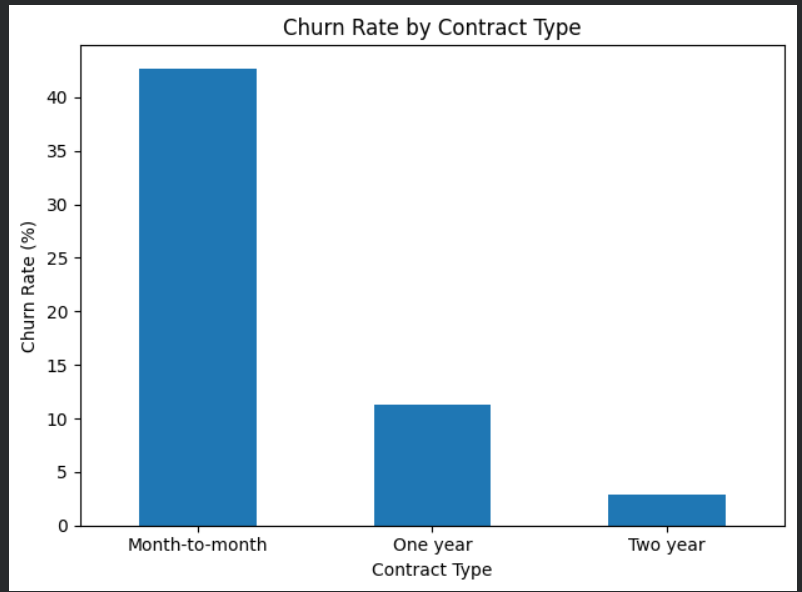

# 📊 Customer Churn Analysis

## 📌 Project Overview

Customer churn is an important business problem for subscription-based companies. Losing customers can reduce revenue and increase the cost of acquiring new customers.

In this project, I analyzed customer data to understand:

- How many customers are leaving the company
- Which customer groups have higher churn rates
- How contract type affects churn
- How internet service relates to churn
- Whether payment method is associated with churn
- How customer tenure relates to churn
- What business actions could help improve customer retention

The analysis was performed using Python and Pandas, with visualizations created using Matplotlib.

## 📂 Dataset

The dataset contains customer information from a telecommunications company.

It includes customer demographics, services, contract details, payment methods, monthly charges, total charges, tenure, and churn status.

### Key columns

- `customerID` — Unique customer identifier
- `gender` — Customer gender
- `SeniorCitizen` — Senior citizen status
- `Partner` — Whether the customer has a partner
- `Dependents` — Whether the customer has dependents
- `tenure` — Number of months the customer has stayed
- `InternetService` — Internet service type
- `Contract` — Contract type
- `PaymentMethod` — Payment method
- `MonthlyCharges` — Monthly customer charges
- `TotalCharges` — Total customer charges
- `Churn` — Whether the customer left the company

## 🛠️ Tools Used

- Python
- Pandas
- Matplotlib
- Google Colab

## 🔍 Analysis Performed

The following analyses were performed to identify patterns and factors associated with customer churn:

- Overall customer churn rate
- Customer tenure analysis
- Churn rate by tenure group
- Churn rate by contract type
- Churn rate by internet service
- Average monthly charges by churn status
- Churn rate by payment method
- Churn rate by senior citizen status
- Churn rate by partner status
- Churn rate by dependents status
- Churn rate by tenure group and contract type

Visualizations were created using Matplotlib to make the churn patterns easier to understand.

## 📊 Key Findings

- The overall customer churn rate was **26.54%**, with 1,869 customers having churned.
- Customers in their first 12 months had a churn rate of **47.44%**, compared with **9.51%** for long-term customers.
- **Month-to-month contracts** had a churn rate of **42.71%**, compared with **11.27%** for one-year contracts and **2.83%** for two-year contracts.
- Customers using **fiber optic internet** had a churn rate of **41.89%**, compared with **18.96%** for DSL customers.
- Customers who churned had higher average monthly charges (**₹74.44**) than customers who stayed (**₹61.27**).
- Customers using **electronic check** had a churn rate of **45.29%**, compared with **15.24%** for customers using automatic credit-card payments.
- Senior citizens had a churn rate of **41.68%**, compared with **23.61%** for non-senior customers.
- Customers without a partner had a churn rate of **32.96%**, compared with **19.66%** for customers with a partner.
- The analysis of tenure and contract type identified **new customers on month-to-month contracts** as a particularly high-churn segment, with an observed churn rate of **51.35%**.

> These findings show associations in the dataset and do not by themselves establish that any particular factor causes customer churn.

## 📊 Churn Rate by Contract Type

## 💡 Business Recommendations

1. **Improve early customer retention**
   - Focus on customers during their first 12 months with better onboarding, proactive support, and early engagement campaigns.

2. **Encourage longer-term contracts**
   - Provide suitable incentives or benefits for customers to move from month-to-month contracts to one-year or two-year contracts.

3. **Target high-risk customer segments**
   - Prioritize retention efforts for new customers on month-to-month contracts, as this segment had an observed churn rate of 51.35%.

4. **Investigate fiber-optic customer churn**
   - Analyze service quality, pricing, outages, complaints, and customer support for fiber-optic customers to understand the high observed churn rate.

5. **Review pricing and monthly charges**
   - Customers who churned had higher average monthly charges, so the company could investigate whether pricing, plan value, or service costs are related to churn.

6. **Improve payment experience**
   - Investigate why customers using electronic checks have a much higher observed churn rate and consider encouraging convenient automatic payment options.

7. **Develop targeted retention campaigns**
   - Use customer characteristics such as tenure, contract type, internet service, payment method, and monthly charges to design more targeted retention strategies.
